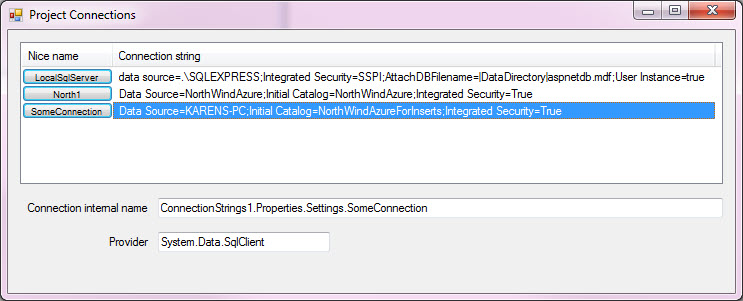

# About
This repository provides a class project which provides methods to get and change connection strings residing in a Windows Forms application configuration file. 

Primarily for server based databases e.g. SQL-Server. 

An accompanying [repository](https://github.com/karenpayneoregon/MicrosoftConnectionDialog) for using the database connection dialog which resides in Visual Studio IDE at runtime.

TechNet article location



## Methods

Change server by connection string name in configurtion file.
```csharp
public bool ChangeServer(string pConnectionName, string pServerName)
```
Change server and catalog by connection string name in configuration file.
```csharp
public void ChangeServer(string pConnectionName, string pServerName, string pCatalog)
```
Change intial catalog by connection string name in configuration file.
```csharp
public void ChangeInitialCatalog(string pConnectionName, string pCatalog)
```
Return all connection string in app.config include default localDb or SQLEXPRESS
```csharp
public List<ProjectConnection> Connections => ConnectionStrings.Cast<ConnectionStringSettings>()
```
Get default connection
```csharp
public ProjectConnection LocalConnection => Connections[0];
```
Has connection in configuration file
```csharp
public bool HasConnections
```
When there is a single connection, return it.
```csharp
public ProjectConnection SoleConnection
```
Get properties for a connection string stored in the application configuration file.
```csharp
public ConnectionProperties Properties(string pConnectionName)
```
Example
```csharp
var ops = new ConnectionHelper();
_projectConnections = ops.Connections;

var connectionName = DefaultConnectionPath(CurrentNamespace(), _projectConnections[1].RealName());
/*
 * Get connection properties for the current connection string in connectionName
 */
var properties = ops.Properties(connectionName);

/*
 * Toggle between two databases - both must match for the TableAdapter classes
 */
ops.ChangeInitialCatalog(connectionName, properties.InitialCatalog == "NorthWindAzure1" ? 
    "NorthWindAzure3" : 
    "NorthWindAzure1");

connectionName = DefaultConnectionPath(CurrentNamespace(), _projectConnections[1].RealName());
```


